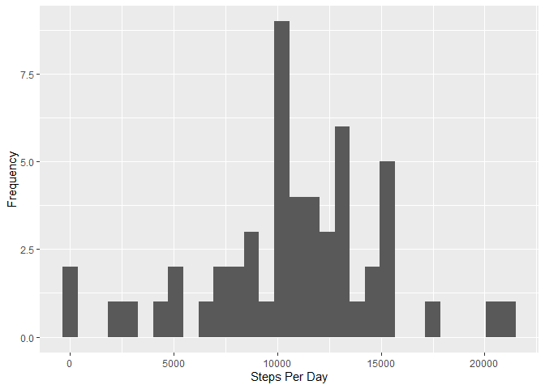
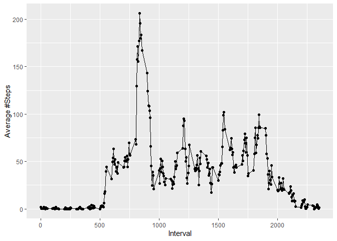
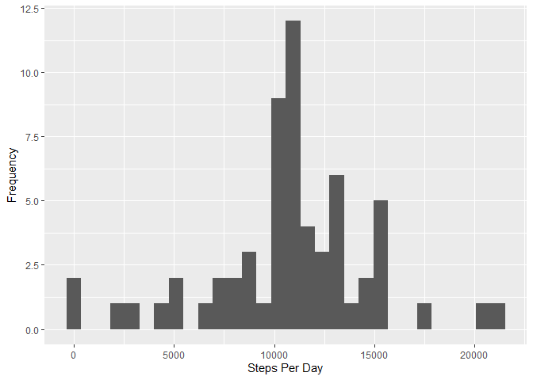
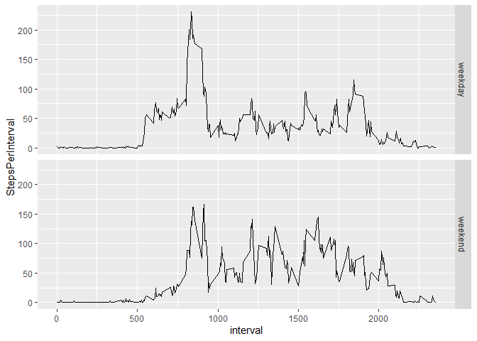

## Loading and preprocessing the data


```r
activity <- read.csv("activity.csv")
library(dplyr)
library(ggplot2)
```
## Histogram of the total number of steps taken each day


```r
stepsPerDay <- tbl_df(activity) %>% filter(steps != "NA") %>% 
                group_by(date) %>% summarize(StepsPerDay = sum(steps))
qplot(stepsPerDay$StepsPerDay, data = stepsPerDay,
      xlab = "Steps Per Day", ylab = "Frequency") # Histogram of the total number of steps taken each day
```

<!-- -->

## Mean and median number of steps taken each day


```r
mean(stepsPerDay$StepsPerDay) # Mean number of steps taken each day
```

```
## [1] 10766.19
```

```r
median(stepsPerDay$StepsPerDay) # Median number of steps taken each day
```

```
## [1] 10765
```

## Time series plot of the average number of steps taken


```r
stepsPerIntervalDF <- tbl_df(activity) %>% filter(steps != "NA") %>% 
                    group_by(interval) %>% summarize(MeanNumStepsPerInterval = mean(steps))
qplot(stepsPerIntervalDF$interval, stepsPerIntervalDF$MeanNumStepsPerInterval, data = stepsPerIntervalDF,
      xlab = "Interval", ylab = "Average #Steps", geom = c("point", "line")) # Time series plot of the average number of steps taken
```

<!-- -->


## The 5-minute interval that, on average, contains the maximum number of steps


```r
filter(stepsPerIntervalDF, MeanNumStepsPerInterval == max(stepsPerIntervalDF[2]))[1] # The 5-minute interval that, on average, contains the maximum number of steps
```

```
## # A tibble: 1 x 1
##   interval
##      <int>
## 1      835
```


## Code to describe and show a strategy for imputing missing data


```r
((nrow(tbl_df(activity)) - nrow(tbl_df(activity) %>% filter(steps != "NA"))) * 100) / nrow(tbl_df(activity)) #13% NAs
```

```
## [1] 13.11475
```

```r
activityMeanStepsPerIntervalDF <- merge(activity, stepsPerIntervalDF, by.x = "interval", by.y = "interval", all = FALSE, all.x = FALSE, all.y = FALSE)
activityMeanStepsPerIntervalDF$steps[is.na(activityMeanStepsPerIntervalDF$steps)] = activityMeanStepsPerIntervalDF$MeanNumStepsPerInterval[is.na(activityMeanStepsPerIntervalDF$steps)] # impute the NA values in the steps column with the means from the respective activities

((nrow(tbl_df(activityMeanStepsPerIntervalDF)) - nrow(tbl_df(activityMeanStepsPerIntervalDF) %>% 
                                                        filter(steps != "NA"))) * 100) / nrow(tbl_df(activityMeanStepsPerIntervalDF)) # 0% NAs after imputation
```

```
## [1] 0
```


## Histogram of the total number of steps taken each day after missing values are imputed


```r
stepsPerDayImputed <- tbl_df(activityMeanStepsPerIntervalDF) %>% 
                group_by(date) %>% summarize(StepsPerDay = sum(steps))
qplot(stepsPerDayImputed$StepsPerDay, data = stepsPerDayImputed, xlab = "Steps Per Day", ylab = "Frequency") # Histogram of the total number of steps taken each day after missing values are imputed
```

<!-- -->

```r
mean(stepsPerDayImputed$StepsPerDay) # Mean number of steps taken each day after imputation
```

```
## [1] 10766.19
```

```r
median(stepsPerDayImputed$StepsPerDay) # Median number of steps taken each day after imputation
```

```
## [1] 10766.19
```
## Panel plot comparing the average number of steps taken per 5-minute interval across weekdays and weekends


```r
weekdays1 <- c('Monday', 'Tuesday', 'Wednesday', 'Thursday', 'Friday')
activityMeanStepsPerIntervalDF <- mutate(activityMeanStepsPerIntervalDF, Weekday = weekdays(as.Date(date)), WeekSegment = ifelse(Weekday %in% c("Saturday", "Sunday"), "weekend", "weekday"))
avgStepsPerIntervalImputed <- tbl_df(activityMeanStepsPerIntervalDF) %>% 
  group_by(interval, WeekSegment) %>% summarize(StepsPerInterval = mean(steps))
qplot(interval, StepsPerInterval, data = avgStepsPerIntervalImputed, geom = c("line"), facets = WeekSegment ~ .) # Panel plot comparing the average number of steps taken per 5-minute interval across weekdays and weekends
```

<!-- -->
